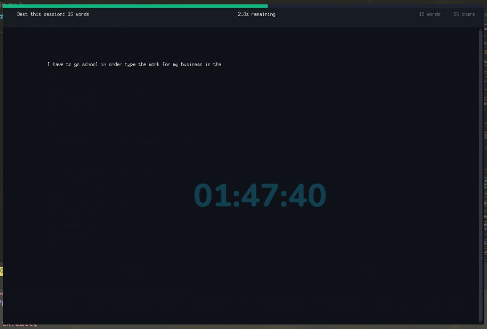

# The Most Dangerous Writing App 🔥

> **A minimalist, distraction-free writing environment that permanently deletes your work if you stop typing for 5 seconds.**


---

## What Is This?

Inspired by the web app of the same name, this is a **Python desktop application** built to demonstrate production-grade software design on a deceptively simple premise:

- You open the app and start typing.
- A **danger bar** at the top of the screen depletes in real time.
- If you **stop for 5 seconds**, everything you've written is **gone — permanently**.
- The only way to keep your work is to keep moving.

This project is part of a **Python desktop application portfolio**, built to demonstrate real-world skills in event-driven GUI programming, object-oriented architecture, and modern UI design with `customtkinter`.

---

---

## 📸 Application Preview




## Features

- **Dark Mode UI** — built with `customtkinter` on a carefully chosen `#111827` background.
- **Live Danger Bar** — a 6 px progress strip at the top of the screen depletes smoothly every 50 ms, shifting colour from green → amber → red.
- **Text Colour Shift** — as idle time drains, the writing area text gradually transitions from warm white → amber → red, giving a visceral sense of impending loss.
- **Countdown Timer** — a real-time `x.xs` display in the status bar.
- **Live Word & Character Count** — updates on every keystroke.
- **Session Best** — tracks the highest word count reached across resets.
- **Flash Animation** — a rapid colour-flash sequence fires on erase before the buffer is wiped.
- **Clean Erase → Reset** — after deletion, the app returns to its idle state with a post-erase message and is ready for a new session immediately.
- **Safe Window Close** — all pending `after()` callbacks are cancelled before `destroy()` is called, preventing any `TclError` or dangling callback crashes.

---

## Architecture

This application is built around a clean **Model → Controller → View** separation. Each layer has a single, well-defined responsibility.

```
┌──────────────────────────────────────────────────────────────┐
│                          WritingApp (View)                    │
│  Owns the CTk window, all widgets, and visual update methods  │
│  Delegates timer logic to TimerController                     │
└────────────────────────┬─────────────────────────────────────┘
                         │ arms / disarms
┌────────────────────────▼─────────────────────────────────────┐
│                    TimerController (Controller)               │
│  Manages after() / after_cancel() debounce handles            │
│  Guarantees at-most-one erase callback and one tick loop      │
│  Mutates AppState on each tick                                │
└────────────────────────┬─────────────────────────────────────┘
                         │ reads / mutates
┌────────────────────────▼─────────────────────────────────────┐
│                        AppState (Model)                       │
│  Pure dataclass: phase, word_count, char_count, ratio         │
│  No Tk dependency — fully unit-testable                       │
└──────────────────────────────────────────────────────────────┘
```

### The Debounce Pattern

The core engineering challenge of this project is **timer debouncing on every keystroke**.

A naive approach — spawning a `threading.Timer` per key event — leads to race conditions, overlapping callbacks, and eventual crashes. This app solves the problem entirely inside Tk's single-threaded event loop:

```python
# On EVERY KeyRelease event:
def arm(self) -> None:
    self._state.reset_idle_clock()   # 1. Reset the elapsed counter in the model
    self._cancel_erase()              # 2. Cancel any existing pending erase callback
    self._erase_handle = self._root.after(  # 3. Schedule a fresh one
        IDLE_TIMEOUT_MS, self._fire_erase
    )
    if self._tick_handle is None:    # 4. Ensure the progress tick loop is alive
        self._schedule_tick()
```

**Why this is correct:**
- `after_cancel()` is O(1) and totally safe to call — if no callback is pending, it's a no-op.
- There is **never more than one** pending erase callback stored in `self._erase_handle`.
- The tick loop (`_do_tick`) re-schedules itself only if `phase == ACTIVE`, so it self-terminates cleanly on erase.
- No threads. No `queue.Queue`. No `threading.Event`. The Tk event loop is the concurrency model.

### State Machine

The session lifecycle is modelled as an explicit `Enum`:

```
          first keystroke           idle timeout
  IDLE ──────────────────► ACTIVE ──────────────► ERASED
   ▲                                                  │
   └──────────────────────────────────────────────────┘
                     after flash animation
```

### Session Phase Transitions

| From | To | Trigger |
|------|----|---------|
| `IDLE` | `ACTIVE` | First non-modifier `KeyRelease` with non-empty text |
| `ACTIVE` | `ERASED` | `TimerController._fire_erase()` fires after 5 s of inactivity |
| `ERASED` | `IDLE` | `_complete_erase()` runs 600 ms after the flash animation starts |

---

## Tech Stack

| Library | Version | Role |
|---------|---------|------|
| `customtkinter` | 6.0+ | Modern dark-mode widget toolkit |
| `tkinter` | stdlib | Root window, `Text`, `Canvas`, event loop |
| `dataclasses` | stdlib | `AppState` model |
| `enum` | stdlib | `SessionPhase` state machine |
| `typing` | stdlib | Full PEP 484 type hints throughout |

---

## Getting Started

### Prerequisites

- Python **3.10** or newer
- `pip`

### Installation

```bash
# Clone the repository
git clone https://github.com/azeemsher788/disappearing-text-writing-app.git
cd disappearing-text-writing-app

# Install the only third-party dependency
pip install customtkinter
```

### Running the App

```bash
python main.py
```

---

## Project Structure

```
90/
├── main.py       # Complete application — Model, Controller, View
└── README.md     # This file
```

The entire application ships as a single, self-contained `main.py` with no internal module splits needed — the file is structured by class boundary, following the principle that module boundaries should reflect logical dependencies, not arbitrary file counts.

---

## Code Quality Highlights

| Practice | Implementation |
|----------|---------------|
| **Type hints** | Every method, parameter, and return type is annotated (PEP 484) |
| **Docstrings** | Every class and public method has a NumPy-style docstring |
| **OOP** | Three-layer class hierarchy with no global state |
| **Enum state machine** | `SessionPhase` makes all legal transitions explicit and auditable |
| **Event loop safety** | Zero threads — all async work goes through `after()` / `after_cancel()` |
| **Resource cleanup** | `WM_DELETE_WINDOW` protocol handler cancels all callbacks before destroy |
| **Single Responsibility** | `AppState` has no Tk imports; `TimerController` has no widget references |

---

## Customisation

All timing and visual constants are defined at the top of `main.py` as module-level constants:

```python
IDLE_TIMEOUT_MS: int = 5_000     # Change to 3000 for hard mode
TICK_INTERVAL_MS: int = 50       # Lower = smoother bar, higher CPU
FONT_FAMILY: str = "Georgia"
FONT_SIZE: int = 18
```

---

## License

MIT — use freely, attribute kindly.

---

*Built as part of a Python desktop application portfolio. Architecture and timer debouncing logic designed to demonstrate production-grade thinking for freelance and contract engagements.*
